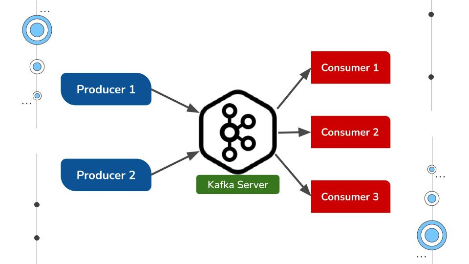
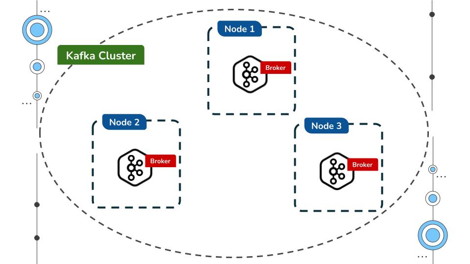
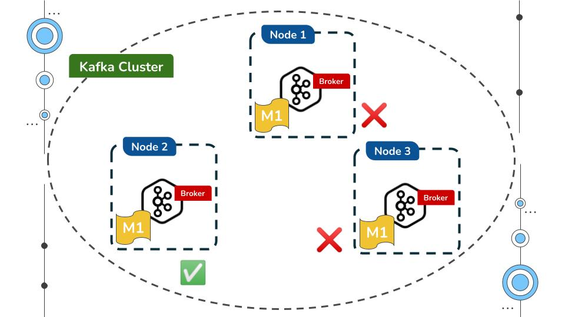
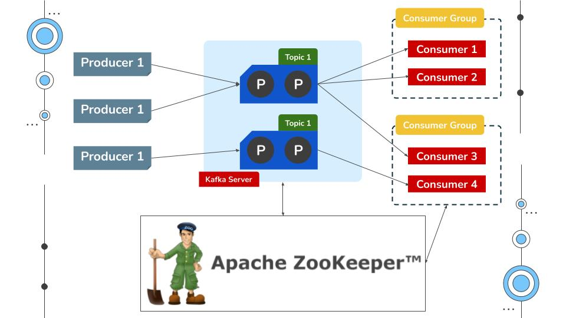

What is Kafka?
==============

- Kafka is just like a messaging system.
  
- It is distributed platform / application

    - In production environment Kafka is referred as Kafka Cluster.
    - A cluster is made up of more than one Kafka server.
    - Each Kafka server is referred as Broker.
    
    

- Kafka is fault-tolerant
    
    - Ability of a system to continue operating without interruption when one or more of its components fail.
    - In Kafka cluster messages are replicated in multiple broker.
    - Replication Factor.

       

- Kafka is Sclable system

    - You can add new brokers anytime.
    - You can increase the number of consumers.

Kafka Handles 1 million messages request per second.

Kafka Architecture
==================

- A Kafka server have different topics.
- You can create multiple topics in Kafka server.
- Those topics have something called partition and every topic have multiple partition.

- Kafka ecosystem have consumer group and there can be multiple Consumer Group.
- Each Consumer Group have 1 or more consumer instances.
- A consumer has to be associate with a Consumer Group.
- Apache Zookeeper is distributed, open-source configuration, synchronization service.
    - Its configuration management system.
    - Which messages consumer has read.
    - cluster information.
    - Topic configuration.

Install Kafka and Zookeeper
===========================

- Download the software [click here...](https://kafka.apache.org/quickstart)
-